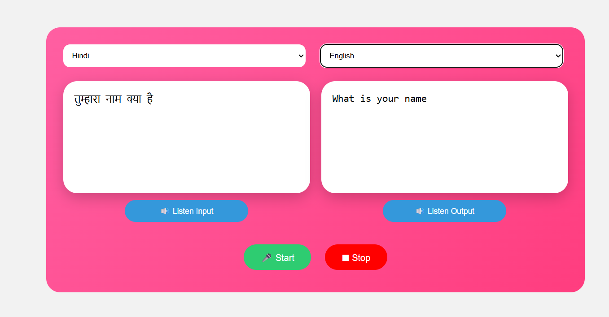

# 🌍 Voice Translator Pro (Laravel + Speech Recognition)

A powerful **real-time voice translator web app** built using **Laravel (Backend)** and **JavaScript Speech Recognition API (Frontend)**.

👉 User bolta hai → text me convert hota hai → instantly translate hota hai → audio ke sath output milta hai 🔥

---

## 🚀 Features

✅ Real-time Voice to Text
✅ Auto Translation (10+ Languages)
✅ Fast Translation (Google API)
✅ AI Improved Translation (OpenAI)
✅ Text-to-Speech Output 🔊
✅ Input & Output dono ka Listen Button
✅ Clean UI with 2 separate boxes
✅ Auto Save Translations in Database

---

## 🛠️ Tech Stack

**Frontend:**

* HTML, CSS (Custom UI)
* JavaScript (SpeechRecognition API)
* Web Speech API

**Backend:**

* Laravel (PHP Framework)
* Google Translate API (Unofficial)
* OpenAI API (Text Improvement)
* MySQL Database

---

## 📂 Project Structure

```
├── app/
│   └── Http/Controllers/
│       └── SpeechController.php
├── database/
│   └── migrations/
│       └── create_speeches_table.php
├── resources/
│   └── views/
│       └── index.blade.php
├── routes/
│   └── web.php
```

---

## 🧱 Database Migration

```php
Schema::create('speeches', function (Blueprint $table) {
    $table->id();
    $table->text('transcription');
    $table->timestamps();
});
```

👉 Ye table user ke translated text ko store karta hai.

---

## ⚙️ Installation Guide

### 1️⃣ Clone Project

```bash
git clone https://github.com/your-username/voice-translator.git
cd voice-translator
```

---

### 2️⃣ Install Dependencies

```bash
composer install
```

---

### 3️⃣ Setup Environment

`.env` file me add karo:

```env
OPENAI_API_KEY=your_openai_api_key_here
```

---

### 4️⃣ Run Migration

```bash
php artisan migrate
```

---

### 5️⃣ Start Server

```bash
php artisan serve
```

👉 Open in browser:

```
http://127.0.0.1:8000
```

---

## 🎤 How It Works

### 1. Voice Input

* User "Start" button dabata hai
* Voice → text me convert hota hai (SpeechRecognition API)

---

### 2. Translation Flow

```
User Speech
   ↓
Text Generated
   ↓
Google Translate API ⚡
   ↓
OpenAI Improvement 🧠
   ↓
Final Output
```

---

### 3. Audio Output

* Translated text → Google TTS API
* Audio generate hota hai
* User "Listen Output" se sun sakta hai

---

## 🔁 API Endpoint

### POST `/save-text`

**Request:**

```json
{
  "text": "Hello",
  "language": "Hindi"
}
```

**Response:**

```json
{
  "status": true,
  "text": "नमस्ते",
  "audio": "base64-audio"
}
```

---

## 🌐 Supported Languages

* English 🇺🇸
* Hindi 🇮🇳
* Bengali
* Punjabi
* Tamil
* Telugu
* Marathi
* Urdu
* Spanish
* French

---

## 🎯 Key Highlights

🔥 Real-time translation (no delay)
🔥 Voice + Text + Audio (3-in-1 system)
🔥 AI-enhanced translation quality
🔥 Lightweight & fast
🔥 Beginner-friendly Laravel project

---

## 📸 UI Overview

* Left Box → Voice Input
* Right Box → Translated Output
* Both have 🔊 Listen buttons
* Start / Stop voice control

---

## ⚠️ Important Notes

* Browser must support **SpeechRecognition API** (Chrome recommended)
* OpenAI API optional hai (fallback Google translation use hota hai)
* Internet required for translation & TTS

---

## 🧠 Future Improvements

* ✅ More languages add karna
* ✅ Chat history UI
* ✅ Download audio feature
* ✅ Mobile optimization
* ✅ Dark mode

---

## 👨‍💻 Author

**Pappu Kumar**
💡 Beginner → Becoming Pro Developer 🚀

---

## ⭐ Support

Agar project pasand aaye to ⭐ star zarur do GitHub par!

---

## 📌 Special Note

Frontend code reference: 
👉 Is file me pura UI + Speech logic diya gaya hai.

---

🔥 **Happy Coding!**
